<!-- Logo -->
<h1 align="center">Stacktower (Docker)</h1>

<!-- Tagline -->
<h4 align="center">A web interface and Docker runtime for Stacktower, which renders package dependency graphs as XKCD-style physical towers.</h4>

<!-- Badges -->
<div align="center">
  <!-- CI -->
  
  <!-- Docker -->
  
  <!-- Issues -->
  
  <!-- Pull Requests -->
  
  <!-- License -->
  
</div>

<!-- Nav -->
<p align="center">
  <a href="#key-features">Key Features</a> •
  <a href="#installation">Installation</a> •
  <a href="#usage">Usage</a> •
  <a href="#documentation">Documentation</a> •
  <a href="#support">Support</a> •
  <a href="#contributing">Contributing</a> •
  <a href="#attribution">Attribution</a> •
  <a href="#license">License</a>
</p>

<!-- Hero -->
<p align="center">
  
</p>

Inspired by [XKCD #2347](https://xkcd.com/2347/), Stacktower draws a dependency graph as a tower where every block rests on what it depends on. Your application sits at the top, held up by libraries below — all the way down to that one critical package maintained by *some dude in Nebraska*.

This repository is a fork of [matzehuels/stacktower](https://github.com/matzehuels/stacktower) that adds a **web interface and a container** on top of the upstream CLI.

## Key Features

* Renders dependency graphs as towers, with block width proportional to how much rests on each package.
* Parses from five registries: PyPI, crates.io, npm, Packagist, and RubyGems.
* Optimal edge-crossing minimisation via branch-and-bound with PQ-tree pruning, with a heuristic fallback.
* Hand-drawn or clean SVG styles, hover popups, and a `--nebraska` ranking of load-bearing packages with few maintainers.
* Accepts any directed graph as JSON — not only package dependencies.
* Adds a `server` subcommand and a Docker image, so the same visualisations work from a browser.

## Installation

```bash
git clone https://github.com/willtheorangeguy/stacktower-docker
cd stacktower-docker
docker compose up --build
```

Then open `http://localhost:8080`.

For the CLI alone, install upstream's — this fork changes nothing about it:

```bash
go install github.com/matzehuels/stacktower@latest
```

Every install path is in [`docs/installation.md`](docs/installation.md).

> **Do not expose the web interface.** It has no authentication, no request limits, and no server timeouts, and each render spawns a subprocess. The render endpoint also fails on a fresh checkout — see [`docs/internal/known-issues.md`](docs/internal/known-issues.md).

## Usage

Parse a package, then render the graph:

```bash
stacktower parse python fastapi -o fastapi.json
stacktower render fastapi.json -t tower --style handdrawn -o fastapi.svg
```

Parsing hits the registry; rendering is offline, so you can re-render as often as you like. Every subcommand and flag is in [`docs/usage.md`](docs/usage.md).

## Documentation

Full documentation lives in [`docs/`](docs/index.md):
[Installation](docs/installation.md) · [Quickstart](docs/quickstart.md) · [Usage](docs/usage.md) · [Configuration](docs/configuration.md) · [API](docs/api.md) · [Architecture](docs/architecture.md) · [Development](docs/development.md) · [FAQ](docs/faq.md) · [Troubleshooting](docs/troubleshooting.md) · [Roadmap](docs/roadmap.md)

## Support

Bugs in tower layout, ordering, or registry parsing belong [upstream](https://github.com/matzehuels/stacktower/issues) — this fork does not diverge there.

For the web server or the container, open a [GitHub Discussion](https://github.com/willtheorangeguy/stacktower-docker/discussions/new) or file an [issue](https://github.com/willtheorangeguy/stacktower-docker/issues/new/choose).

## Contributing

Contributions welcome. See the org-wide [Contributing Guide](https://github.com/willtheorangeguy/.github/blob/main/CONTRIBUTING.md) and [Code of Conduct](https://github.com/willtheorangeguy/.github/blob/main/CODE_OF_CONDUCT.md).

Visualisation changes should go upstream; server and container changes belong here.

## Attribution

This is a fork of [matzehuels/stacktower](https://github.com/matzehuels/stacktower), used under the [Apache License 2.0](LICENSE.md).

All dependency parsing, graph reduction, layering, crossing minimisation, layout, and SVG rendering are upstream's work. This fork adds `internal/cli/server.go`, the `Dockerfile`, and `docker-compose.yml`, and changes nothing else about how Stacktower works.

The project story and interactive examples live at [stacktower.io](https://www.stacktower.io), which is upstream's site, not this repository's.

## License

Apache-2.0 — see [`LICENSE.md`](LICENSE.md).
